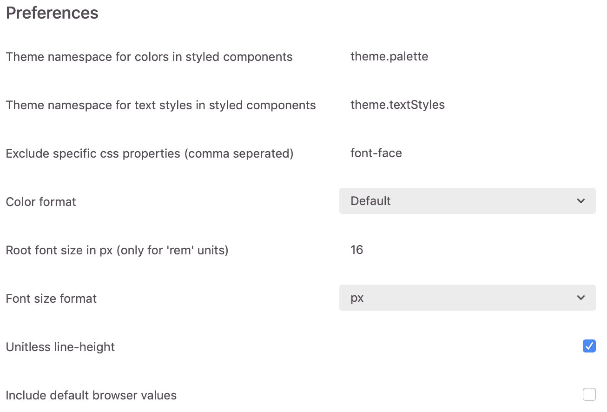

# Zeplin Styled Components • [](LICENSE.txt)

A [Zeplin](https://extensions.zeplin.io/) extension that generates [Styled Component](https://www.styled-components.com/) snippets from colors, text styles and layers. 💅

## Getting started

Download the extension from the Zeplin extensions website : [Zeplin Styled Components](https://extensions.zeplin.io/). Open a Zeplin project and see the magic!

#### Prerequisites
- [A Zeplin account](https://zeplin.io/)

## Usage
### Colors and textstyles
For color and textstyles output go to the ***styleguide*** tab.

Click the download icon  to export your styles into your project directly!


#### Sample colors output:
```js
// colors

export default {
  alert1: '#e00202',
  alert2: '#8fbe49',
  global1: '#0d62a5',
  global2: '#a7a9ac',
  global3: '#009ad9',
  neutral1: '#ffffff',
  neutral2: '#000000',
  neutral3: '#333333',
  neutral4: '#848484',
  neutral5: '#dee4ea',
  neutral6: '#e6e6e6'
}
```
#### Sample textstyles output:
```js
// textStyles

import { css } from 'styled-components';

export default {
  alertNeutral4: css`
    font-size: 14px;
    color: ${({ theme }) => theme.palette.neutral4};
    letter-spacing: 0.4px;
    line-height: 1.57;
    font-family: TheSansLF;
    font-weight: 300;
 `,

  heading12neutral3: css`
    color: ${({ theme }) => theme.palette.neutral3};
    line-height: 1.1;
    font-size: 40px;
    font-family: TheSansLF;
    font-weight: 700;
 `,
 };
```
### Layers
For layers output click on any layer wihtin a project
#### Sample layer output:
```js
export const Tooltip = styled.div`
  ${({ theme }) => theme.textStyles.paragraph1Neutral3};
  height: 347px;
  width: 351px;
  background-color: ${({ theme }) => theme.palette.neutral1};
  border-radius: 2px;
  box-shadow: 0 1px 5px 1px rgba(51, 51, 51, 0.1);
  border: 1px solid rgb(230, 230, 230);
`;
```

### Options
The're several options you can modify to make this plugin your own and more options are coming in the future! See the [roadmap](##roadmap) our plans for the future.



#### Options description:
* ***Theme namespace for colors in styled components:*** Use this option if you have a different namespace for theme colors in your project than the default provided. Namespaces will automatically be destructured in the output.
* ***Theme namespace for text styles in styled components:*** The same as the color namespace option but for text styles.
* ***Exclude specific css properties (comma seperated)*** : If you don't want specific css properties to be generated/exported you can comma seperate them here!
* ***Color format:*** In which format the colors will be generated here you can choose:
    * Default (HEX)
    * HEX
    * RGB
    * HSL

If you have more ideas/requests for additional options checkout our [CONTRIBUTING](CONTRIBUTING.md) page for enhancements or issues.

## Roadmap
Currently we are working on the following release:
### Zeplin Styled Components 0.2.0
* Font-size option to change the default (px) to em, rem
* Option to change the default spacing of 2 characters to something that will fit the need of your project
* Put fonts used in project in seperated js export
* Option to change unitless line-heights

## Contact

This project is maintained by [*Nick Verstocken*](https://github.com/nickverstocken)

Got any questions or ideas? We'd love to hear from you. Check out our [contributing guidelines](CONTRIBUTING.md) for ways to offer feedback and contribute.


## License

Copyright (c) [November Five BVBA](https://novemberfive.co). All rights reserved.

Licensed under the [MIT](LICENSE.txt) License.
